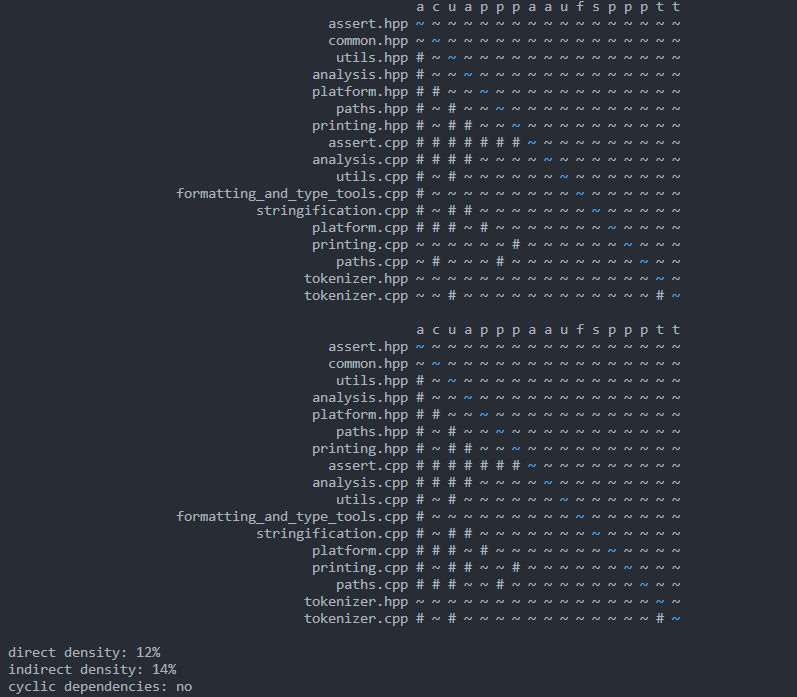
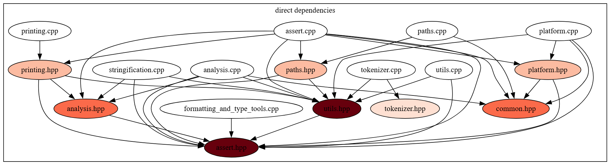
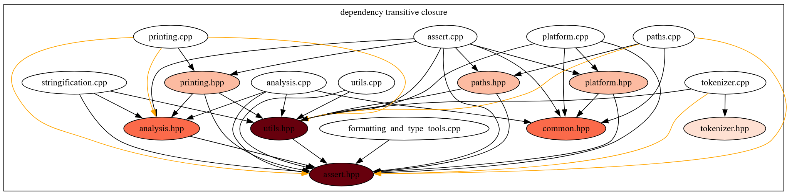

This project is now mostly folded into https://github.com/jeremy-rifkin/build-blame

---

This is a small static analysis project to analyze dependency graphs in C/C++ programs. Based off of
a main file in a codebase, this tool will automatically parse, resolve, and traverse includes in
order to build up a dependency graph. That graph is displayed as an adjacency matrix. The transitive
closure of the graph is also displayed reflecting the indirect dependencies between parts of a
codebase. One application of this tool is for analyzing technical debt within a codebase.







Nodes are colored based on how many translation units (.c or .cpp files) transitively include a given header.

Usage:
```
python3 main.py --compile-commands COMPILE_COMMANDS [--exclude EXCLUDE] [--sentinel SENTINEL]
```

By default the script will transitively walk all include headers it can resolve, either based on local resolution rules
or paths specified with `-I` flags in compile_commands.json. If you want to see the includes for an unresolved library
include, e.g. `fmt/format.h`, pass `--sentinel fmt/format.h`.
