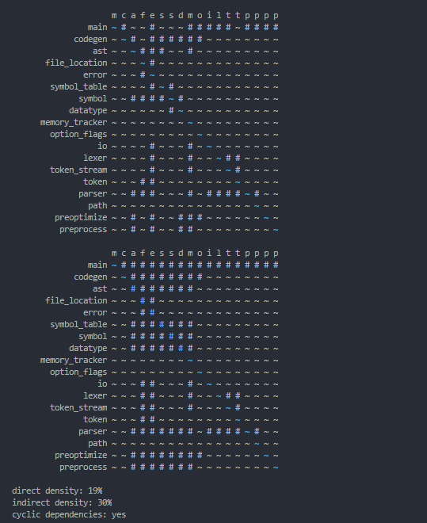
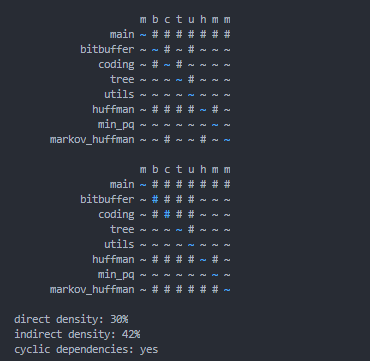
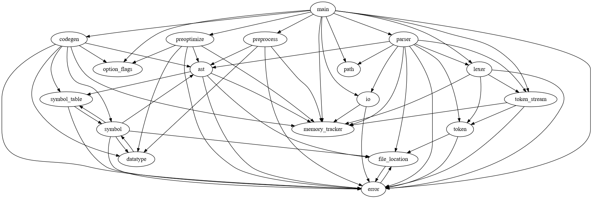
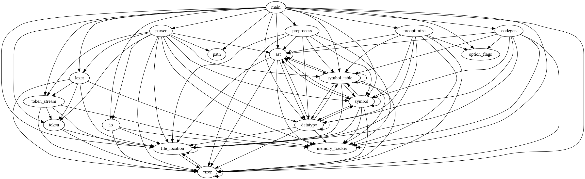

This is a small static analysis project to analyze dependency graphs in C/C++ programs. Based off of
a main file in a codebase, this tool will automatically parse, resolve, and traverse includes in
order to build up a dependency graph. That graph is displayed as an adjacency matrix. The transitive
closure of the graph is also displayed reflecting the indirect dependencies between parts of a
codebase. One application of this tool is for analyzing technical debt within a codebase.

